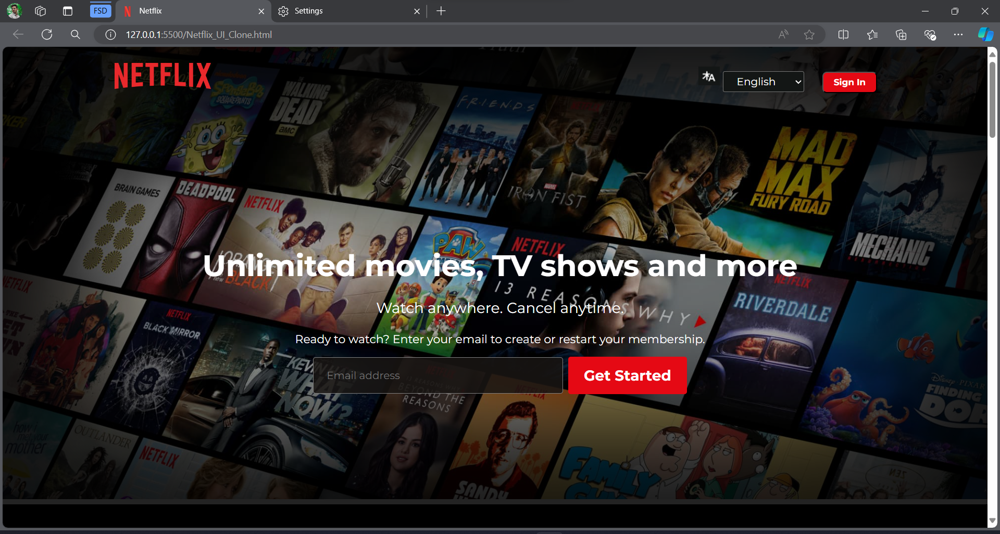

# Netflix UI Clone
 In this project, I built a Netflix UI Clone using HTML, CSS, and JavaScript. The goal was to replicate the visual design and basic functionality of Netflix's homepage. The project features a responsive layout, movie sections with horizontal scrolling, providing a familiar user experience similar to the original Netflix interface.
<h2>Demo</h2>

A project to replicate the user interface of Netflix using HTML and CSS. This clone focuses on mirroring the aesthetic and layout of the Netflix homepage.

## Features
- **Responsive Design**: The UI adjusts to different screen sizes using Flexbox and Grid layouts.
- **Language Toggle**: Users can switch between English and Hindi, with the language change reflected in the HTML `<lang>` attribute.
- **FAQ Section**: Click on a question to reveal or hide the corresponding answer. Only one answer is shown at a time.

## Technologies Used
- **HTML**: For structuring the content.
- **CSS**: For styling the UI components.
- **JavaScript**: For interactive features like the FAQ toggle and language selector.

## File Structure
- `Netflix_UI_Clone.html` - Main HTML file for the website.
- `assets/` - Directory containing images and CSS files.
  - `images/` - Contains image files used in the project.
- `CSS/` - Contains CSS files for styling.
    - `styles.css` - Complete styling.
- `scripts/` - Contains the JS file
    - `app.js` - Complete Functionality (FAQ)

## Code Details
### JavaScript
- FAQ Toggle Functionality: Toggles the visibility of answers in the FAQ section.
- Language Selection: Changes the language of the page based on the user's selection.
### CSS
- Variables: Defined for font, color, and button styles.
- Layout: Uses Flexbox and Grid for responsive design.
- Styling: Consistent styling for buttons, text, and layout elements.

## Contributors
**Ramajan Tahashildar**
